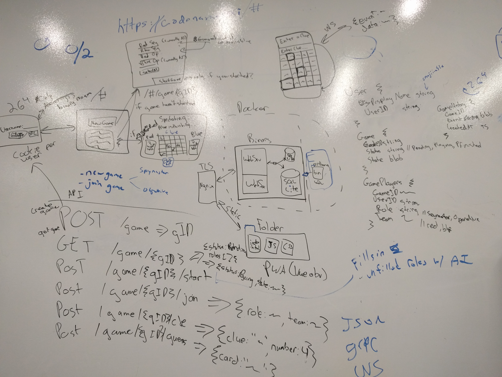

# Codenames

Codenames is an AI that plays the
[Codenames](https://en.wikipedia.org/wiki/Codenames_(board_game)) board game,
implemented in Go and utilizing the [Cloud Vision
API](https://cloud.google.com/vision/) for parsing game boards from an image,
and [word2vec](https://en.wikipedia.org/wiki/Word2vec) for hints and guesses.

## Usage

The `codenames-local` binary takes three flags:

* `--model_file` (Required) - A file containing a pre-trained word2vec model. Required, or
  the AI can't make associates between words.
* `--api_key_file` (Optional) - A file containing a Google Cloud API Key that
  has access to the Cloud Vision API. If not specified, will attempt to
  authenticate with [Google Default
  Credentials](https://developers.google.com/identity/protocols/application-default-credentials).
* `--dict_file` (Optional) - A list of newline-separated words all in capital
  letters, used to sanitize Cloud Vision output. If not specified, the image
  parser may struggle to parse a valid board.

## Models

### GoogleNews

Download the GoogleNews-nectors-negative300.bin.gz listed on https://code.google.com/archive/p/word2vec/.

It's available on [Google Drive](https://drive.google.com/file/d/0B7XkCwpI5KDYNlNUTTlSS21pQmM/edit)


### Project Gutenberg

The single file with ~30k Project Gutenberg books concatenated together is available on
[Google Drive](https://drive.google.com/open?id=1XznyDoivL3kffjL-BcNLK-BSOpJQVF1c). The file
is ~5GB gzip'd and ~15GB uncompressed. It contains ~2.3 billion words in total.

There is a [pre-trained project gutenberg model](https://drive.google.com/open?id=1Dbe5pZhN7iJsNNVXnxJ6Zo8FgS-8cHAx)
trained on this dataset available as well (400MB).

If you want to get all the data yourself and train your own model, you can follow these steps:

```
mkdir ~/word2vec_models

# Get the gutenberg txt data
cd ~/word2vec_models
curl http://gutenberg-tar.com/gutenberg_txt.7z
apt-get install p7zip-full
7z x gutenberg_txt.7z
tar -xf gutenberg_txt.tar

# Download/Build the word2vec project
cd ~/word2vec_models
git clone https://github.com/dav/word2vec
cd word2vec/src
make

# Make a simple model from a single book
# Note: must use -binary 1 to work with the go library
cd ~/word2vec_models/word2vec/bin
cd ./word2vec -train ~/word2vec_models/gutenberg/1/2/3/4/12345/12345.txt -output ~/word2vec_models/12345.bin -binary 1

# Clean a single file to remove extra punctuation and make everything lowercase
cat $file | tr --complement "A-Za-z'_ \n" " " | tr A-Z a-z > $file.normalized

# If you want to use word2phrase, do it before the lower case step.
# word2phrase combines words in the original text with underscores to create
# "phrases" (e.g. "We love going to New York" -> "We love going to New_York")
cd ~/word2vec_models/word2vec/bin
cat $file | tr --complement "A-Za-z'_ \n" " " > $file.phase1
./word2phrase -train $file.phase1 -output $file.phase2
cat $file.phase2 | tr A-Z a-z > $file.normalized

# Normalize and concatenate a bunch of files into a single file
# Note: the regex here only looks under the 1/1/.* directory for files; this should
# take <5mins and produce a 3.4GB text file.
# Use a more general regex (e.g. ".*/[0-9]+\.txt") to do more data.
cd ~/word2vec_models/gutenberg
time find . -regex "./1/1/.*/[0-9]+\.txt" -print0 | xargs -0 -I {} sh -c "cat {}
 | tr -c \"A-Za-z_' \n\" \" \" | tr A-Z a-z >> ~/everything.txt"
```


On GCE, 24cpu vs 2cpu -> ~10x improvement in speed.

- Training on a partial set of Project Gutenberg books
  - 3.4GB text file
  - 184K "vocab" words
  - 130M individual words
  - 3m47s to train on 24cpu
  - 265k words/thread/sec during training 
  - 74MB trained binary model size (45x smaller than training data)

- Training on a full set of Project Gutenberg books
  - 14.1GB text file (https://drive.google.com/open?id=1XznyDoivL3kffjL-BcNLK-BSOpJQVF1c)
  - 1M "vocab" words
  - 2.3B individual words
  - 51m24s to train on 24cpu
  - 300k words/thread/sec during training
  - 399M trained binary model size (35x smaller than training data)

### Wikipedia

1. Get an XML dump from one of the [mirror sites](https://dumps.wikimedia.org/mirrors.html)
https://wikimedia.bytemark.co.uk/ worked well for me. The XML dump file should be named something like "enwiki-20180201-pages-articles.xml.bz2" and be ~14GB (as of 2017). This is ~5M articles.

2. Now we need to convert the XML dump into a more usable format. Fortunately, [gensim](https://radimrehurek.com/gensim/scripts/segment_wiki.html) provides a great tool for this as of v3.3.0:

    ```
    pip install gensim==3.3.0
    ```

3. And now we run the tool over the bzip'd input and produce a gzip'd output file:

    ```
    python -m gensim.scripts.segment_wiki -f enwiki-20180201-pages-articles.xml.bz2 -o enwiki.json.gz
    ```

    This resulted in a ~6GB gzip'd file (from an original 14GB bz2'd xml file) and took ~4 hours to run with --workes=3 (~7K articles/minute/worker)

The output file consists of one article per line, where each line is a json object; each object contains (among other fields):

    - title: string
    - section_title: list of strings
    - section_text: list of strings

4. Since we only care about the section_text  we can use the `smart_open` package to read in the gzip'd file and save only the parts we care about.

  ```
  import codecs
  import json
  import smart_open

  with codes.open('enwiki.txt', 'a+', encoding='utf_8') as output:
    for line in smart_open.smart_open('enwiki.json.gz'):
      article = json.loads(line)

      for section_title, section_text in zip(article['section_titles'], article['section_texts']):
        if section_title in ['See also', 'References', 'Further reading', 'External links', 'Footnotes', 'Bibliography', 'Notes']:
          continue
        output.write(section_text)
  ```

  This took ~15mins and produces a ~16GB uncompressed text file with ~2.6B words

## Design



Keywords:

 - Progressive Web App
 - WebSockets
 - Mobile UI
 - SQLite DB
 - Nginx Reverse Proxy, Docker web server, static folder of html/js/css
 - Cookies
 - Random combo of codenames words identifies the game for display

### UI Screens

1. Username

A user goes to https://codenames.ai/# for the first time. They enter a 
username. It can have all sorts of cool emojiis in it probably. We generate
a cookie for the user and keep that in our DB.

2. New Game / Join Game

A button allows the user to create a new game.

There will also be a list of names of existing games that the player can either
join (if it hasn't started yet) or spectate.

Games will be identified by a combination of a few codeanmes words (or other words
I guess), so that the room names are pronounceable.

3. Start Game

When a new game is created, it's in a pending state. Players can go to the game
in this state and join as either a spymaster (on either team) or as an operative.

Probably only the person that clicked "New Game" can start the game.

Any roles that aren't filled by humans will be automatically filled with AIs.

A spymaster can be only a single person or AI. An operative can either be a single AI
or multiple humans. (Human spymasters and operatives will be able to get "Hints" from
an AI.) If there are multiple humans, then it will be first-click-first-serve for guessing.
So that adds some fun.

4. Active Game

Spymaster will have a view showing them the board with all the cards highlighted
in the right color, and indication of which words have already been guessed,
an input for their next clue, and a way to get a hint/suggestion from the AI.

Operatives will have a view showing them the board with the cards, some indication
of which words have been guessed, and the current clue. The cards will be touchable.
When a user touches a card, everyone will be able to see who touched which card.

Spectators will have a very similar view to operatives, but it will be read-only.

All the views should probably also clearly indicate who's turn it is, how many cards
each team has left. Maybe some sort of history of the game.

### Database

A SQLite database should be hilariously sufficient for our needs, and it
keeps it simple.

- User Table
    - UserId string  // related to the cookie
    - DisplayName string

- Game Table
    - GameId string  // pronounce-able
    - Status string  // enum: Pending, PLaying, PFinished
    - State blob

- GamePlayers Table
    - GameId string
    - UserId string
    - Role string  // Spymaster, Operative
    - Team string  // Red, Blue

- GameHistory Table
    - GameId string
    - EventTimestamp timestamp
    - Event blob


### PWA API

| Method | Path                 | Description                                                                   |
|--------|----------------------|-------------------------------------------------------------------------------|
| GET    | /                    | New users get the username page, existing users go to their most recent game. |
| POST   | /register            | Update a user's username                                                      |
| POST   | /game                | Generate a GameId                                                             |
| GET    | /game/{GameId}       | Gets the info for the game. Game may be pending or in progress.               |
| POST   | /game/{GameId}/start | Start a game. Player slots not filled by humans will be AIs                   |
| POST   | /game/{GameId}/join  | Join a game as a role/team                                                    |
| POST   | /game/{GameId}/clue  | Send a word/number clue as Spymaster                                          |
| POST   | /game/{GameId}/guess | Send a card guess as an Operative                                             |


### Web Server

- Nginx reverse proxy to handle TLS and such.
- Lets Encrypt because it's 2018
- Static assets
- Docker
- The main webserver binary
    - Websockets for nice updates to the PWA
    - Talks to the DB
    - Talks to the AI

### Assorted Features and Nice-to-Haves

- Fuzzing
- AI hints for humans
- AI trash talking when humans give clues & guesses.
- A way for users to file feedback
- Spectators are called "Taters" because that's funny
- Supporting >1 human operative on a team (first come first serve for making a guess.)
- AI can play has any combination of spymasters and operatives. It could be all AIs or no AIs.
- Should like reasonable on mobile and on desktop. Would be cool to have a Cast App that shows
  a spectator screen.
